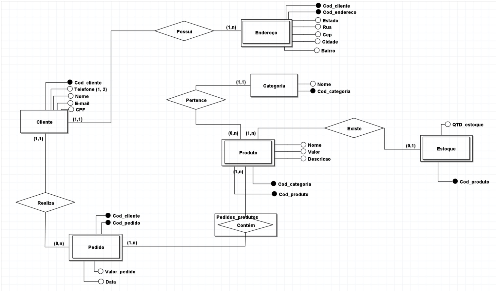
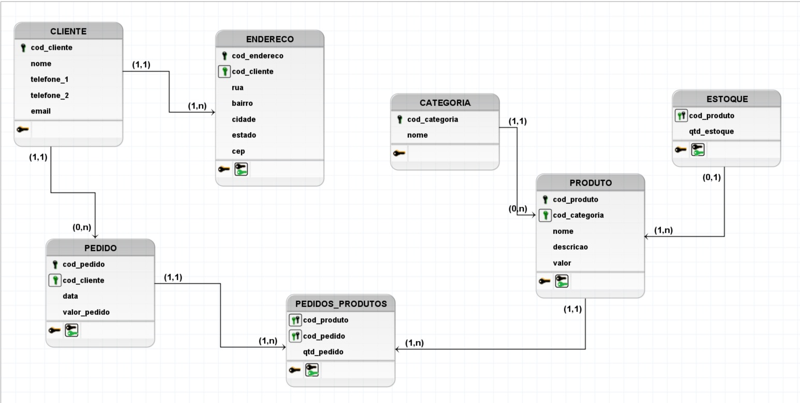
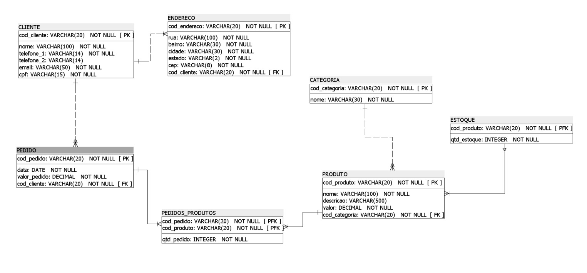

# 1º PROJETO PRÁTICO - DADOS
Primeiro projeto prático do Programa Desenvolve 2024 - Grupo Boticário em parceria com Alura (Trilha de Dados)

O projeto consiste na construção de um modelo de banco de dados relacional que representa o negócio do Boticário. Ele leva em consideração os conceitos e entidades relacionados à parte de vendas, sistema de pontuação e gestão de produtos em estoque.

 

## ✏️ Índice:

1. <a href="#entidades">Entidades</a>
2. <a href="#modelo-conceitual">Modelo Conceitual</a>
3. <a href="#modelo-logico">Modelo Lógico</a>
4. <a href="#modelo-fisico">Modelo Físico</a>
5. <a href="#tecnologias">Tecnologias Utilizadas</a>
6. <a href="#pessoas-autoras">Pessoas Autoras</a>

 

## 1. 📝 Entidades

### Neste projeto trabalharemos com sete entidades (tabelas).

1.1 - CLIENTES
* Aqui faremos o registro dos clientes, esta tabela contém seis atributos diretos, são eles:
    * cliente_id (primary key de identificação do cliente);
    * nome;
    * telefone_1;
    * telefone_2 (Opcional);
    * email;
    * cpf.
 

#### Exemplo de SELECT de clientes 

  

1.2 - ENDEREÇOS
* Aqui faremos o registro dos endereços, esta tabela contém sete atributos, são eles:
    * cliente_id (foreign key - relação com a tabela clientes);
    * endereco_id (primary key - identificador do endereço);
    * rua;
    * bairro;
    * cidade;
    * cep;
    * estado.

 

#### Exemplo de SELECT de endereços

  

1.3 - PEDIDOS
* Aqui faremos o registro dos pedidos, esta tabela contém quatro atributos:
    * cliente_id (foreign key - relação com a tabela clientes);
    * pedido_id (primary key - identificador do pedido);
    * valor_pedido;
    * data_pedido.

 

#### Exemplo de SELECT de pedidos

  

1.4 - CATEGORIAS
* Aqui faremos o registro das categorias, esta tabela contém dois atributos:
    * categoria_id (foreign key - relação com a tabela categorias);
    * nome.    

 

#### Exemplo de SELECT de categorias

  

1.5 - PRODUTOS
* Aqui faremos o registro dos produtos, esta tabela contém cinco atributos:
    * categoria_id (foreign key - relação com a tabela categorias);
    * produto_id (primary key - identificador do produto);
    * valor_produto;
    * nome;
    * descricao.

 

#### Exemplo de SELECT de produtos

  

1.6 - PEDIDOS_PRODUTOS
* Aqui faremos o registro do relacionamento M:N entre pedidos e produtos, esta tabela contém três atributos:
    * pedido_id (foreign key - relação com a tabela pedidos);
    * produto_id (foreign key - relação com a tabela produtos);
    * qtd_produto.

 

#### Exemplo de SELECT de pedidos_produtos

  

1.7 - ESTOQUE
* Aqui faremos o registro dos produtos em estoque, esta tabela contém dois atributos:
    * produto_id (foreign key/primary key - relação com a tabela produtos e também identificador do registro);
    * qtd_estoque.

 

#### Exemplo de SELECT de estoque

  

## 2. 📐 Modelo Conceitual

* Essa etapa, em uma modelagem de banco de dados, consiste em criar um modelo um pouco mais abstrato. Focando em capturar as entidades, seus atributos e os relacionamentos entre elas, sem se preocupar com os detalhes da implementação. 

 

  

## 3. ⌨️ Modelo Lógico

* Nesta etapa, em uma modelagem de banco de dados, iniciamos a inserção dos detalhes de implementação. Definimos as tabelas com suas respectivas chaves primárias, estrangeiras e todas as restrições de integridade.  

 

  

## 4. 💪 Modelo Físico

* Nesta etapa, em uma modelagem de banco de dados, temos uma implementação concreta no ambiente de banco de dados.

 

 

## 5. 🛠 Tecnologias e Ferramentas Utilizadas

- [SQL](https://learn.microsoft.com/pt-br/sql/?view=sql-server-ver16)
- [PostgreSQL](https://www.postgresql.org/docs/)
- [BR Modelo](https://www.brmodeloweb.com/lang/pt-br/index.html)
- [SQL Power Architect](https://dbmstools.com/tools/sql-power-architect)

 

## 6. 👩🏽‍💻Pessoas Autoras:

<h4>Flávia Santos</h4>

Linkedin: https://www.linkedin.com/in/flavia-santos-dev/
